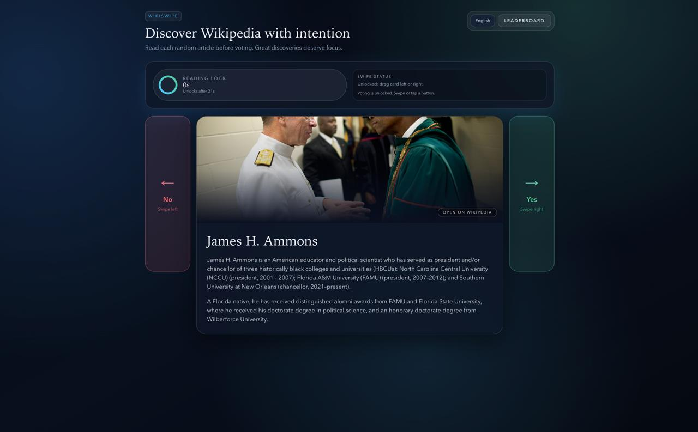

# WikiSwipe



**WikiSwipe** is a Tinder-style discovery app for Wikipedia.  
You get a random article, read it for a **dynamic timer** (based on text length), then vote:
- left / No
- right / Yes

The app stores votes and builds a live leaderboard of community favorites.

## Highlights

- Random Wikipedia discovery with quality filtering
- Mandatory dynamic reading lock before voting
- Swipe gestures + tap buttons
- Persistent ranking (`score = likes - dislikes`)
- Multi-language UI and article translation:
  - English
  - Russian
  - German
  - French
  - Chinese
  - Spanish
- Session restore: current article and timer survive page refresh
- Encrypted server-side session state (tamper-resistant article/timer lock)
- **PWA support** (installable app + service worker)
- Mobile-first layout with bottom navigation bar

## Dynamic Reading Timer

WikiSwipe calculates reading lock per article summary:

- Average reading speed baseline: **240 words/min**
- Formula: `ceil(words / 240 * 60)`
- Bounds: **15s minimum**, **120s maximum**

This timer is enforced both:

- in UI (countdown lock),
- and on backend (vote endpoint validation),

so voting cannot be submitted early by changing client-side values.

## Tech Stack

- Next.js (App Router)
- React + TypeScript
- Tailwind CSS
- Framer Motion
- Prisma
- SQLite

## Project Structure

```text
app/
  api/
  leaderboard/
  layout.tsx
  page.tsx
components/
hooks/
lib/
prisma/
public/
```

## Local Setup

```bash
npm install
cp .env.example .env
npm run db:generate
npm run db:migrate
npm run dev
```

Set a strong `SESSION_SECRET` value in `.env` before production deploy.

Open the URL shown by Next.js in terminal (usually `http://localhost:3000`).

## Scripts

```bash
npm run dev         # start dev server
npm run dev:reset   # clear .next and restart dev
npm run build       # production build
npm run start       # run production server
npm run lint        # eslint
npm run clean       # remove .next cache
npm run db:generate # generate prisma client
npm run db:migrate  # sync schema to sqlite (db push)
npm run db:studio   # open prisma studio
```

## PWA

WikiSwipe includes:

- Web app manifest (`/manifest.webmanifest`)
- Service worker (`/public/sw.js`)
- App icons (`/public/icons/*`)

You can install it from supported mobile/desktop browsers.

## Scoring Model

For each article:

- `likes`
- `dislikes`
- `score = likes - dislikes`

Leaderboard sorting:
1. `score` descending
2. `likes` descending

## Troubleshooting

If you see chunk/runtime errors like `Cannot find module './331.js'`:

```bash
npm run dev:reset
```

If you previously installed WikiSwipe as PWA and then updated code, clear old service worker once:

1. Browser DevTools -> Application -> Service Workers -> Unregister
2. Application -> Storage -> Clear site data
3. Reload the page

If port `3000` is busy, Next.js will automatically choose another one.

## License

MVP project, use and modify freely.
